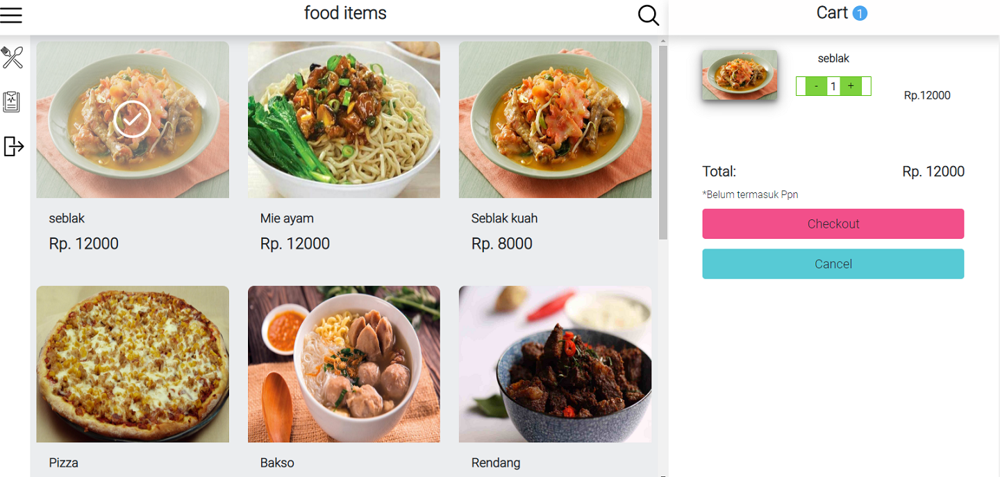
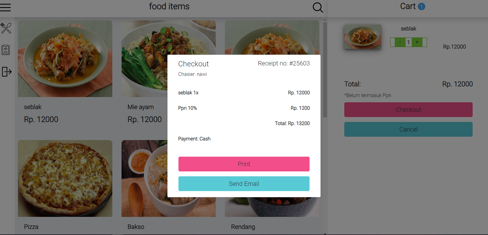
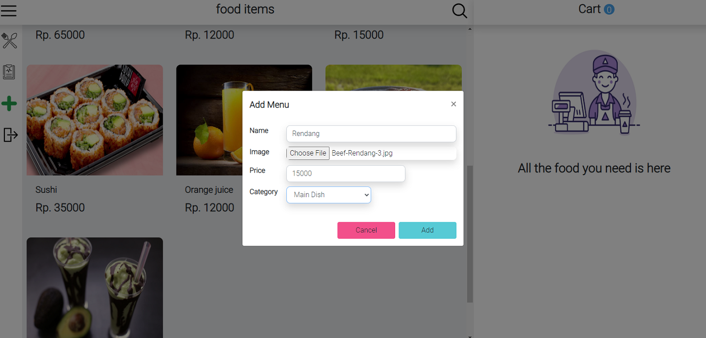
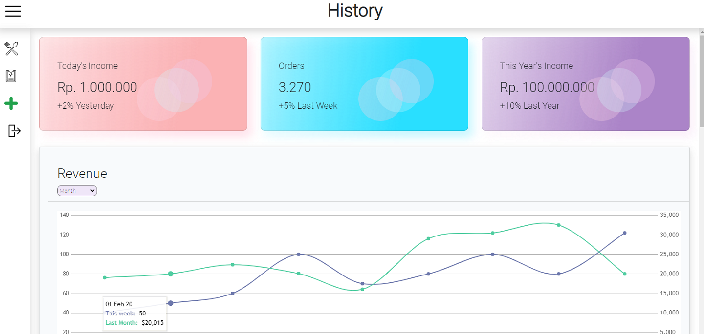

<h1 align="center">Cafe Grool</h1>

## Table of Contents

- [Table of Contents](#table-of-contents)
- [Introduction](#introduction)
- [Built with:](#built-with)
- [Features](#features)
- [Requirements](#requirements)
- [Usage for development](#usage-for-development)
- [Screenshots](#screenshots)
- [Demo](#demo)
- [Contributors](#contributors)

## Introduction
<b>Cafe Grool</b> is a cashier application to assist cashiers in serving restaurants or other customer orders.
This application is equipped with admin access to add, modify, and delete food menus.

## Built with:
- [React js](https://reactjs.org/)
- [Node js](https://nodejs.org/en/)
- [Express js](https://expressjs.com/)
- [jquery](https://jquery.com/)
- [MySQL](https://www.mysql.com/)
- [Bootstrap](https://getbootstrap.com/)

## Features
* Cashier must sign in before use this app
* Cashier can handle(print or send email) order list of customer
* Admin can add, modify, delete and edit menus.
* And others

## Requirements
* [`npm`](https://www.npmjs.com/get-npm)
* [`react-js`](https://reactjs.org/)

## Usage for development
1. Open your terminal or command prompt
2. Type `https://github.com/NawiOne/cafe_Grool.git`
3. Open the folder and type `npm install` for install dependencies
4. Type `npm start` for run this app.

## Screenshots

     
    
    
    

## Demo
[Cafe Grool](http://54.197.88.112:8081/)

## Contributors

  <table>
    <tr>
      <td align="center">
        <a href="https://github.com/NawiOne">
           
          <b>Nawirudin</b>
        </a>
      </td>
    </tr>
  </table>

